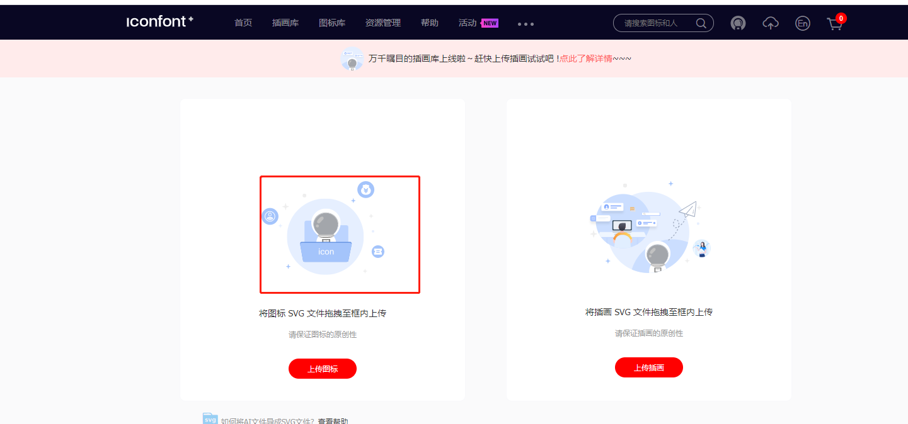

# element ui 组件使用定义icon
##  制作icon的svg文件
自定义icon需要市县制作好svg文件，或通过第三发网站把png等格式图片转换成svg文件。


## 2.iconfont网站制作

### 2.1上传icon到iconfont网站

登录iconfont网站，在我的资源中页面中，把svg拖放到上传区域。





选中需要使用的icon添加到购物车

在购物车中把icon添加到项目

在项目中编辑项目，设置FontClass前缀和Font Family（**element-ui 自定义图标一定要把 font family修改成 element-icons**）


然后在项目中点击“下载至本地”，把相关文件下载到本地。


## 3.下载iconfont网站文件并在本地使用

把下载的压缩包解压开，选择其中的6个文件，存放到public/assets/icon文件夹中。


在main.js中添加 iconfont.css的引用

``` javascript
import '../src/assets/icon/iconfont.css'
```

在使用icon的组件中

``` javascript
<el-button type="text"  icon="el-icon-bianji">导出</el-button>
```


# 注意事项

如果在使用自定图标之后，图标只出现一个黑色框框，那么很有可能你的font family没有修改成 element-icons

修改后应该如下图：


